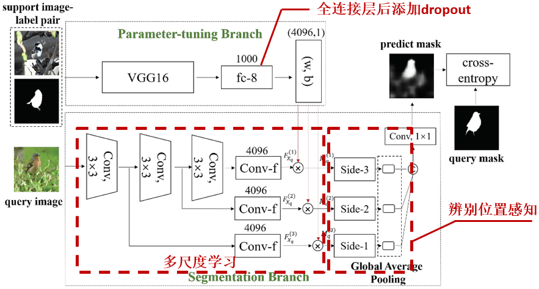

# The implement of MDL model for segmentation based on few short learning

## Introduction

Few-shot semantic segmentation methods aim for predicting the regions of different object categories with only a few labeled samples. It is difficult to produce segmentation results with high accuracy when a new category appears. In this paper, we propose a Multi-scale Discriminative Location-aware (MDL) network to tackle the few-shot semantic segmentation problem. In order to use information from different levels, we first keep the last three convolutional layers of FCN, and then use the VGG-16 network to extract features from the
support image-label pair, which adjusts the weight of the query image segmentation branch. Discriminative location-aware architecture can improve the efficiency of few-shot segmentation, and therefore the global average pooling layer is added to produce location feature information. Finally, we evaluate our MDL model on the Pascal VOC 2012 challenge, and show that it achieves competitive mIoU score compared to methods in recent years.

## The Struction of MDL model

Multi-scale Discriminative Location-aware model Architecture.



## Illustration

1. Download and clone OSLSM source code:

    ```
    git clone https://github.com/lzzcd001/OSLSM.git
    ```

2. Put this project folder on the OSLSM path, then build Caffe before using this source code.

3. Complete the configuration and data pre-processing according to the OSLSM instruction.

## Training MDL model

    ```
    sudo chmod u+x train.sh
    ./train.sh
    ```

## Testing MDL model


## Acknowledgment and Citations

This code is based on OSLSM. Thanks to the contributors of OSLSM.


	@inproceedings{dong2019surface,
	  title={Multi-scale discriminative location-aware network for few-shot semantic segmentation},
	  author={Dong, Zihao et. al},
	  booktitle={2019 IEEE 43rd Annual Computer Software and Applications Conference},
	  pages={42--47},
	  year={2019}
	}
